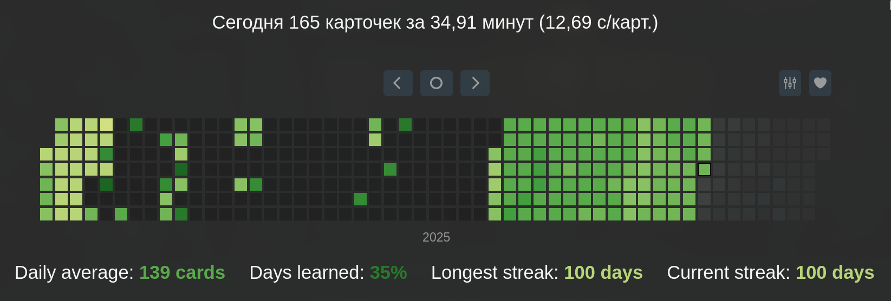
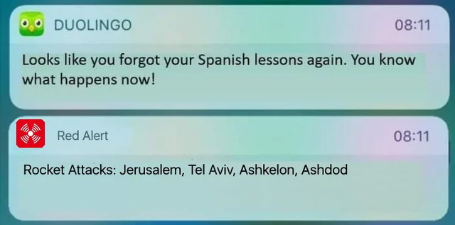
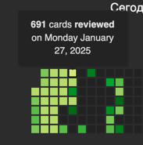
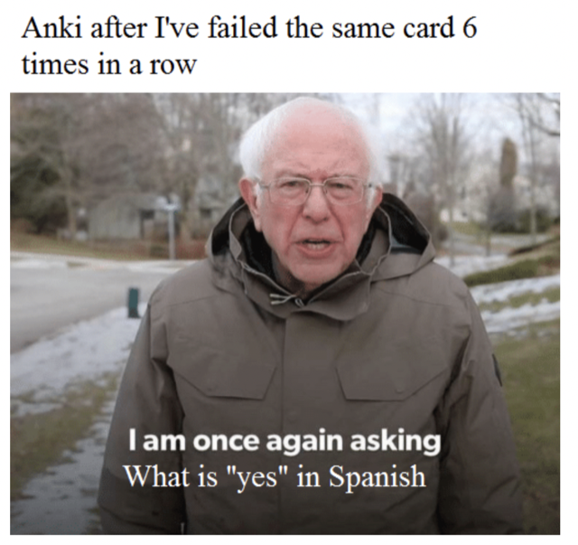

+++
date = '2025-11-06T13:54:35Z'
draft = false
title = 'База по Анки'
+++

## Введение

*Статистика аля-гитхаб, но про изучение карточек. Чем цвет более светлый, тем больше изучалось в день*

Уже довольно продолжительное время я занимаюсь языками (испанский, японский, английский) с переменным успехом. 
При этом довольно долго уже пытаюсь играться со всякими карточками для запоминания лексики. Среди всех дуолингво
квизлетов и прочего я выбрал именно анки. Сказать честно, путь это не самый простой, но мне кажется, я нащупал
более-менее оптимальный вариант изучения без боли. Кажется так, потому что вот уже 100 дней у меня всё идет отлично
и одна из колод (Испанская) скоро закончится.
## Дисклеймер
Важно сказать, что все в статье основано на личном опыте, каждому свое (с). Тем не менее можете попробовать :)
## Что такое карточки?
На всякий случай: флешкарты — карточки, на которых с одной стороны содержится что-то, напоминающее вопрос, а с обратной — 
что-то, напоминающее ответ. Например, при изучении языков, с одной стороны можно написать слово на испанском, а с другой
его значение, произношение и предложение в контексте. Набор таких карточек называют декой. Алгоритм их показа обычно 
устроен так, что показывает чаще то, что вы знаете хуже и наоборот. Собственно вот и вся механика). 
## Зачем в принципе учить по карточкам?
Лексика — очень важная часть почти любого языка. К счастью, из-за того, что многие языки родственны, если ты знаешь
один язык, то ты знаешь часть лексики другого. Например, в японском с катаканой это немного абсурдно выходит, но при
этом заимствований с китайского хватает, испанский заимствует у латыни и соседних языков и т.д. Но естественно
это не означает, что ты можешь забить на лексику и надеяться, что как-то пассивно ее познаешь. К сожалению, увеличение
словарного запаса — тяжелый труд, которым придется заниматься (говорю, как небольшой любитель такого).
## Карточки — не заменяют все остальное
Да, это важно проговорить: кроме карточек **нужно** заниматься грамматикой, чтением, аудированием и т.п. Желательно с 
учителем, который вас поправляет и ставит правильное произношение, знакомит с нюансами и т.д.
## Я пользуюсь дуолингвой, квизлетом, другим проприетарным сервисом для карточек и мне норм
### Дуолингво

Вообще, обучение по дуолингво — уже какой-то мем в интернете. Как будто бы всем понятно, что это какая-то шляпа,
которая заставляет тебя повторять йоддефицитные предложения типа кошка выпила молока и третирует за пропуски. Я не буду
говорить, что обучение по дуолингво — совсем херня, но это очень неэффективно по мне и совсем сведено к неуместно простой
геймификации. Перейдя на что-либо ещё вы просто будете учить **больше и лучше**, а также получите больший контроль над 
процессом. Из минусов, у совы очень крутой движок, "подсаживающий" вас на карточки. Всё-таки в каждой шутке есть доля
шутки, поэтому этот момент придется компенсировать извне.
### Квизлет и прочие сервисы для карточек
Отлично! Это и правда хорошие по-своему сервисы (в основном тем, что они берут скучные рутины на себя). Но 
1. **Платно**: куча фичей под пейволом сейчас, куча будет потом
2. **Кастомизация**: прикольные плагины и прочее (например разные алгоритмы подбора карточек) вам недоступны. Пользоваться
можно только тем, что выдал добрый дядя Сэм.

Поэтому если в общем квизлет и прочие closed-source сервисы и хороший шаг вперед от зеленой совы, но нам все еще есть
куда стремиться!
## Время

*for what?*

Самое важное, что нужно понимать при изучении языка — сколько времени в день будет нормально ему уделять? Например, одно
дело, если вы приехали в японскую языковую школу и учите японский весь день, другое — вы простой работяга, а язык — ваше
хобби. Может быть вы вообще в стране, язык которой вы не знаете и от знания зависит (почти) выживание? Короче говоря, мои
советы будут скорее к работягам, потому что именно такой путь я прошел.

Так сколько времени выделять на карточки? На многих уважаемых ресурсах говорится об 1 часе в день для успешного накопления
запаса, я склонен соглашаться. Когда я только начал путь, я учил много разных колод, абсолютно бесконтрольно увеличивая
сложность (на картинке со статистикой в начале года вы можете видеть светлые полосы). В день я мог повторять по 400–500 
карточек. Это даже принесло "пользу" — у меня появилась неплохая база слов. Но я хапнул такого выгорания, что не хотел
трогать карточки еще довольно долгое время (видны мои потуги вернуться). Если сильно не думать над стратегией на старте,
можно выхватить головокружение от удачного изучения (первые карточки всегда простые), а потом сильно хапнуть кортизола, 
повторяя в 10ый раз 300ую карточку.

В итоге пришел к выводу, что для борьбы с выгоранием, нужно упростить себе изучение. Я взял 2 основные колоды 
(испанскую и японскую), составленные не мной, но с основной базой по словам. Поставил там хард лимит на новые и 
повторяемые карточки (5 и 50 соотв) для каждой из колод. В итоге учил по 10 новых слов в день, что с одной стороны
медленно, но с другой именно это соотношение не вызывает во мне отторжения уже довольно долго, при этом скорость 
изучения достойная. Поэтому ту же настройку советую по первой вам: **10 новых 100 повторяемых**. Также есть вариант на
вкат: **20 новых 200 повторяемых**, но как только почувствуете, что устаете от анки, сразу снижайте, иначе смерть!)
### Самоконтроль
Решил поставить этот топик после топика про время, потому что это **критически** важно: без ежедневных или просто регулярных
подходов к анки вы забьете и потеряете дисциплину, а после этого и весь темп (проверено). Если в самих карточках советы 
общие еще как-то можно давать, то для тайм-менеджмента все индивидуально не просто от человека к человеку, а от периода
жизни человека к периоду жизни человека. Поэтому советую то, что помогает мне сейчас, т.к. тайм-менеджмент — это игра
со своим мозгом в "обмани меня", и стратегию иногда приходится менять) Так вот: я использую [Todoist](https://app.todoist.com/app/today) + бота, который со 
включенными уведами (со звуком, это важно) долбит мне в лс, если задача не сделана, пока я ее не сделаю. Я ушел от концепции
календарного подхода к анкам и задача теперь просто их сделать когда-то за день (что к счастью удается).
## Anki

Скачивать [тут](https://apps.ankiweb.net). Также советую сразу регнуться в AnkiWeb, это поможет вам синхронизировать
анки на всех устройствах (да, можно и на телефон, и на комп, и на мак скачать). Основное время рекомендую учить с компа,
т.к. будет доступно много плагинов. О них ниже
## Плагины
Можно учить карточки и без них, но это не так весело! Из этого [видео](https://youtu.be/sNoEq-MOpDc?si=OtD7VnWDSPFt1q7P)
(обязательно к просмотру, если учить хотите по несколько часов в день) достал 
[замечательный набор плагинов](https://telegra.ph/Nastrojka-Anki-Yomitan-Jidoujisho-i-ASBplayer-12-30). Все инструкции + установка внутри.
**Важно**: подходит не только для изучения японского)
## Колоды

Самому составлять колоды (это нам в любом случае потребуется дальше) — настоящий неироничный геморрой. Чтобы не забивать
себе голову поначалу всем этим, советую начинать с готовых колод (там наверху лучше нас знают!), а после уже составлять свои.
### Kaishi 1.5k
Для начала изучения японского крайне рекомендую именно эту деку: полторы тысячи слов/выражений **_в контексте_**, к 
каждому приведено произношение. Есть русская и английская версии. В русской есть огрехи с переводом (он иногда машинный 
будто), но все правится руками при встрече карточки, так что не бойтесь) Если хорошо с английским языком, то смело берите 
оригинал

JP-EN (original): https://github.com/donkuri/Kaishi

JP-RU (translation): https://github.com/NeonGooRoo/KaishiRu
### Refold ES1K
Тут у меня было желание: "найти как кайши", нашел в принципе достойную деку, но **платно** 
[ссылка на покупку](https://refold.la/store/fundamental-vocabulary-to-learn-spanish/). В принципе в личку можете 
написать, скину, мне не жалко, просто дека вышла довольно качественная: произношение, перевод контекст. Единственный минус
— она на английском. Но меня это устраивало, а на русском альтернативу не нашел.
### Новые колоды
Когда вам будет комфортно с вашей колодой и темпом (10 новых слов в день или какой-то еще), можете попробовать добавлять
еще какую-то нагрузку сюда, но на свой страх и риск! Например можете майнить, но в очень низком темпе (потом наверстаете).
#### Неправильные глаголы
Со временем, я почувствовал необходимость подучить неправильные глаголы в испанском, поэтому добавилась 3я колода —
"Испанские неправильные глаголы". Её я сделал через чатгпт и CSV, который он мне нагенерил, вышло довольно удобно и 
стахановскими темпами (по 20 новых карточек в день) я выучил по 150 неправильных глаголов разных времен. Удалось держать
темп скорее из-за того, что карточки были довольно простые, с понятными паттернами (чередование o-ue, e-i и т.п.), саму 
деку я уже выучил, поэтому остается только иногда смотреть карточки, чтобы повысить их запоминаемость.
### Майнинг
В [статье про настройку плагинов](https://telegra.ph/Nastrojka-Anki-Yomitan-Jidoujisho-i-ASBplayer-12-30) анки вы могли 
заметить плагины для майнинга новых карточек для браузера. В мире анки майнинг — добавление нового слова или выражения
в деку, после того как ты его встретил в жизни. Например, при просмотре фильма/аниме или при прочтении книжки/сайта. Само 
составление карточек дело муторное, составление же **хороших** карточек дело ОЧЕНЬ муторное, но всякие проги помогают с
этим справиться. Я пока придерживаюсь дедовского слово — значение (контекст), но стоит потыкаться в решениях из статьи 
после того, как одолеете первые колоды. До этого лезть можно, но предупрежу, что вы скорее устанете, чем выучите. Также
не рекомендую вносить все подряд в деку, мозг очень хреново реагирует на тяжелые, незапоминающиеся слова + это деморализует.
## Заключение
Ну вот собственно и всё, чем я хотел поделиться, со временем я буду дополнять свою статью, но уже сейчас материала хватает,
чтобы с кайфом вкатиться, чего и вам желаю! Учите языки с удовольствием, спасибо за прочтение)