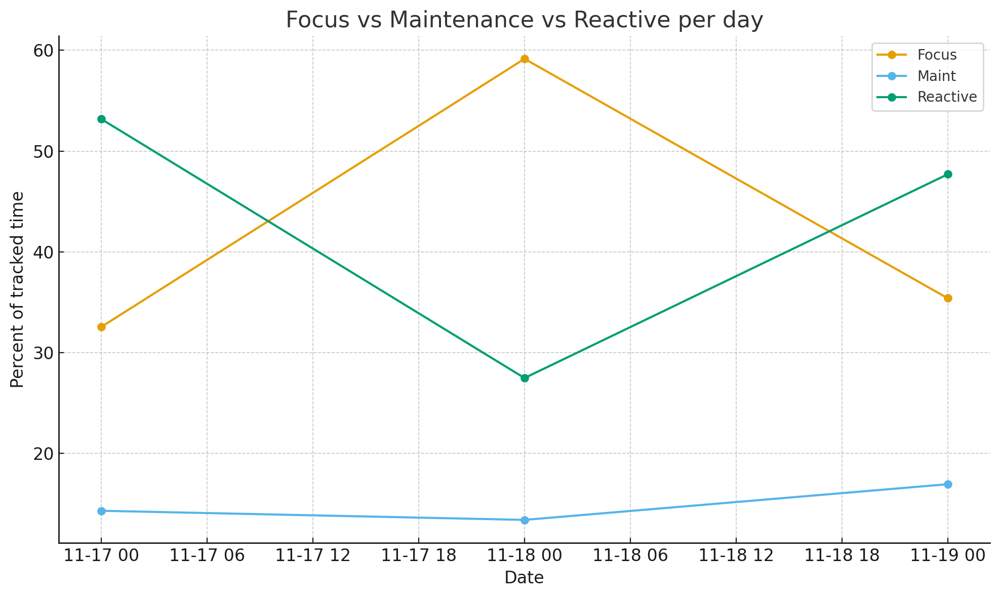
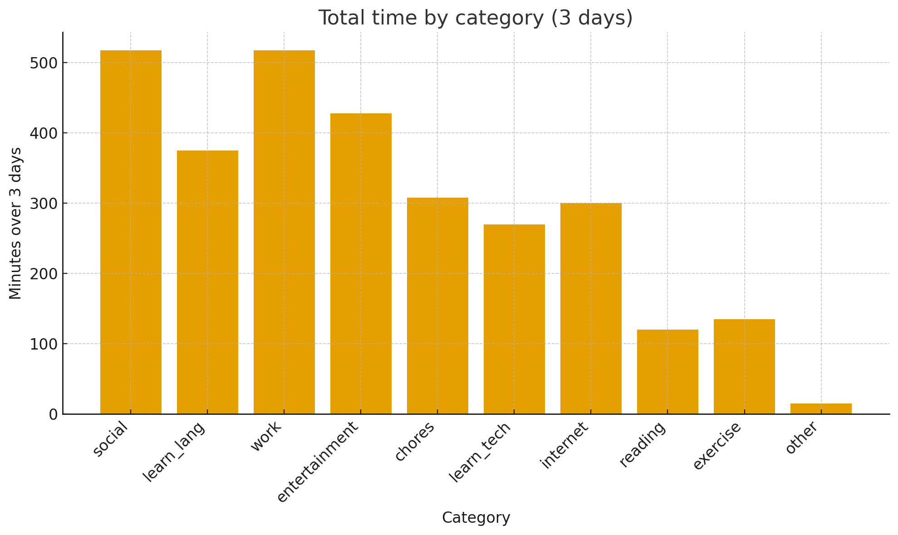

+++
date = '2025-11-21T02:28:35Z'
draft = false
title = 'База по Анки'
+++

# Трек активности каждые 15 минут
Смотря ***очередное*** видео про таймтрекеры и всю эту эффективность (стараюсь особо этого не делать последнее время, пока мои метóды работают), услышал интересную идею: *А давай ты будешь 3 дня подряд трекать что ты делал **каждые 15 минут**, а после соберешь статистику и проанализируешь это.* Идея меня заинтересовала, так что я немедленно приступил к делу. (отложил на понедельник)
# Yet another tg bot
Мне нужен был трекер, который сам будет меня опрашивать каждые 15 минут, а мои ответы складывать в базочку. Также после 3 дней он должен был мне выдать мои результаты в удобоваримом виде (для меня и гпт). Решено было не пользоваться чем-то,  а навайбкодить на гошке бота, тем паче, что в этом я разбираюсь, а cursor нынче кодит довольно прилично для чего-то мелкого.
В итоге сделал вот такого ботика: @urakasanbot (кидаю, только чтоб пофлексить авой, он сейчас выключен за ненадобностью). Исходный код [тут](https://github.com/JkLondon/uraka). Запустить его можно буквально заполнив .env и поменяв время в 2 местах (можете в личке узнать)
Если будут какие-то реквесты (больше адын), то запущу его на серваке и настрою нормально работу с пользователями. Могу только сказать, что чувствую, что без него бы сгорел либо на треке времени, либо на экспорте данных.
# Что было эти 3 дня с моей стороны?
Ничего особенного, начало рабочей недели, где были занятия английским, испанским и пр. Ощущалось, конечно, как какое-то давление, что должен хотя бы кратко писать в бот что делал эти 15 минут, но в принципе все было гладко (кроме начала и конца первого дня, там бот все-таки нашалил, пришлось править "на лету").
## Что я хотел бы получить?
Наверное, я хотел получить какие-то инсайты на свою рутину, понять че каво у меня по work-life-study balance, подумать как что-то улучшить и где.

# Результаты
Ниже представлены некоторые диаграммы на основе моих данных. Focus – время, потраченное на "полезную" активность и тратящее много "мыслетоплива", Reactive – время, которое тратится на всяковое развлекалово (игры, интернет, дискорд, аниме), Maintenance – время, которое тратится на всякие рутины типа гигиены, приема пищи и т.п.

По анализу данных стало видно, что:
1. Языки и Anki – **6+ часов**за три дня. Это очень плотный объём, особенно с учётом ежедневной регулярности (утренний/дневной блок) (учу 3 языка + так совпало, что шло 2 занятия подряд).
2. Часть (внушительная) чтения и курсов идёт после 22:00–23:00. Это повышает общую «производительность по часам», но нагружает нервную систему в то время, когда мозг уже хочет спать.
3. За три дня я провёл с собственным стартапом столько же времени, сколько со всеми соцсетями вместе, но распределение по дням очень неровное: один день — почти нет продуктивной работы, другой – марафон на 10+ часов
4. Главное не то, что реактива много, а что**он сильно перемешан с фокусными активностями** – микс «работа+дис», «аниме+дис», «анки+инет».
5. В среднем – 43 % фокуса, 42 % реактива, 15 % рутины; что является даже немного выше среднего
6. ощущение, что «всё время работаешь», на самом деле складывается из **микса обучения, работы и постоянного присутствия в соцканалах**
   В общем можно навыводить еще много чего интересного, но я оставил тут самое, по-моему, интересное.
# Выводы?
Ну для меня это не стало прям чем-то супер неожиданным, скорее хотелось оценить для внутреннего самозванца: насколько я загружен. Чатгпт сказал, что это довольно несправедливо высокая нагрузка, даже не смотря на реактив. Скорее всего он прав, именно такое невыделение времени под "вставить текст" портит продуктивность и ведет к выгораниям, так что надо следить за краником, чего и вам советую!

